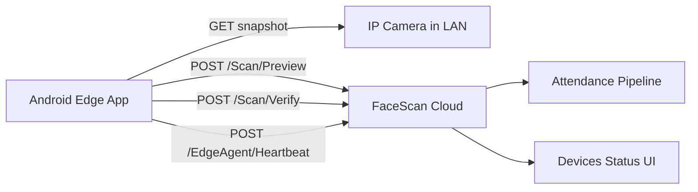

# Android Edge App Plan (IP Camera Auto Scan -> Cloud)

เอกสารนี้ออกแบบแอป Android สำหรับติดตั้งหน้างาน โดยทำงานเฉพาะโหมดสแกนอัตโนมัติจากกล้อง IP Camera และส่งข้อมูลไปเซิร์ฟเวอร์ FaceScan ที่กำหนด URL ได้

## 1) เป้าหมายระบบ

- ติดตั้งง่ายบน Android (Tablet/Box/Phone)
- ไม่ต้องเปิดหน้าเว็บตลอดเวลา
- รองรับการตั้งค่า URL เซิร์ฟเวอร์ปลายทางได้จากหน้า Config
- สแกนอัตโนมัติแบบต่อเนื่อง (walk-by)
- แสดงสถานะเชื่อมต่อและ heartbeat ในระบบกลาง

## 2) ขอบเขตฟีเจอร์ของ Android App (MVP)

- โหมดเดียว: Auto Scan from IP Camera
- หน้า Login แบบ Station (ใช้ StationCode + StationToken)
- หน้า Config
  - Server URL
  - Station Code
  - Station Token
  - Snapshot URL
  - Camera Username/Password (optional)
  - Scan Interval (ms)
  - Min Confidence
  - Heartbeat Every N Frames
- หน้า Monitor
  - Last Scan Result
  - Requests/sec แบบง่าย
  - Online/Offline badge
  - Last heartbeat time
- Service ทำงานเบื้องหลัง (Foreground Service)

## 3) สถาปัตยกรรมแอป

- UI Layer (Jetpack Compose)
  - ConfigScreen
  - MonitorScreen
  - HealthScreen
- Domain Layer
  - ScanLoopUseCase
  - SendHeartbeatUseCase
  - ConnectivityUseCase
- Data Layer
  - CameraSnapshotClient (HTTP Digest/Basic)
  - FaceScanApiClient (Retrofit/OkHttp)
  - LocalConfigStore (DataStore)
  - LocalQueueStore (Room, optional for retry)

## 4) Data Flow

## 5) Config Chart (วิชาร์ทการคอนฟิกระบบ)

| Key | Required | Example | Description |
|---|---|---|---|
| serverUrl | Yes | https://scan.school.ac.th | URL เซิร์ฟเวอร์สำหรับรับข้อมูลสแกน |
| stationCode | Yes | MAIN-GATE | รหัสจุดสแกน |
| stationToken | Yes | ******** | token ของจุดสแกน |
| snapshotUrl | Yes | http://192.168.1.50/.../picture | URL snapshot ของกล้อง |
| cameraUser | No | admin | user กล้อง |
| cameraPassword | No | ******** | รหัสกล้อง |
| intervalMs | Yes | 1500 | รอบสแกนต่อภาพ |
| minConfidence | Yes | 0.60 | เกณฑ์ยอมรับผล |
| heartbeatEveryNFrames | Yes | 10 | ความถี่ heartbeat |
| timeoutSeconds | No | 8 | timeout ต่อคำขอ |
| enablePreview | No | true | ส่ง preview ก่อน verify |

## 6) API Contract ที่ Android ใช้

- POST /Scan/Preview
- POST /Scan/Verify
- POST /EdgeAgent/Heartbeat

หมายเหตุ:
- ใช้ API เดิมได้ทันทีตาม .NET/Python edge agent ที่มีอยู่
- เพิ่ม API ใหม่ภายหลังได้สำหรับ remote config

## 7) แผนพัฒนา (Roadmap)

### Phase 0: Technical Spike (3-5 วัน)
- ทดสอบดึง snapshot จากกล้องจริง 2-3 ยี่ห้อ
- ทดสอบ authenticate กล้องแบบ Basic/Digest
- ตรวจ latency ภาพ -> server -> response

### Phase 1: MVP App (2 สัปดาห์)
- Android app + Config screen + Monitor screen
- Scan loop + heartbeat + error handling
- Persist config ด้วย DataStore
- ส่งข้อมูลเข้า cloud สำเร็จ และเห็นสถานะในหน้า Devices

### Phase 2: Reliability (1-2 สัปดาห์)
- local retry queue เมื่อ internet ขาด
- backoff + circuit breaker
- health check dashboard ในแอป

### Phase 3: Deployment Ops (1 สัปดาห์)
- QR provisioning (โหลด config จาก QR)
- remote log upload
- signed release APK/AAB + MDM deployment guide

## 8) แนวทางติดตั้ง Android หน้างาน

1. เตรียม Station ในระบบ FaceScan ให้เรียบร้อย
2. ติดตั้ง APK (หรือผ่าน MDM)
3. เปิดแอปและกรอก Config
4. กด Test Connection
5. เริ่ม Foreground Service
6. ตรวจ heartbeat และสถานะออนไลน์ที่หน้า Devices

## 9) ข้อกำหนดเครือข่ายและความปลอดภัย

- Android ต้องเข้าถึงกล้องใน LAN ได้
- Android ต้องออก internet ไป cloud ผ่าน HTTPS (443)
- บังคับ TLS 1.2+
- เก็บ token แบบ encrypted at rest (Android Keystore + encrypted prefs)
- รองรับ token rotation โดยไม่ต้อง reinstall

## 10) โครงสร้างโปรเจกต์ Android ที่แนะนำ

- tools/edge-agent-android/
  - app/
  - core-network/
  - core-storage/
  - feature-config/
  - feature-monitor/
  - worker-scan/

## 11) งานฝั่งเซิร์ฟเวอร์ที่แนะนำเพิ่ม

- เพิ่ม endpoint สำหรับ remote config (optional):
  - GET /EdgeAgent/Config?stationCode=...
- เพิ่ม heartbeat SLA ตั้งค่าได้จากระบบกลาง
- เพิ่มหน้า admin สำหรับดูสถานะ Android agent แยกตามสาขา/กล้อง

## 12) Definition of Done (MVP)

- Android app ตั้งค่า server URL ได้จาก UI
- สแกนอัตโนมัติจาก IP camera ต่อเนื่อง >= 8 ชม.
- heartbeat อัปเดตในหน้า Devices ได้
- เปลี่ยน token แล้วแอปทำงานต่อได้โดยไม่ลงใหม่
- มีคู่มือติดตั้งหน้างาน 1 หน้า (quick start)
